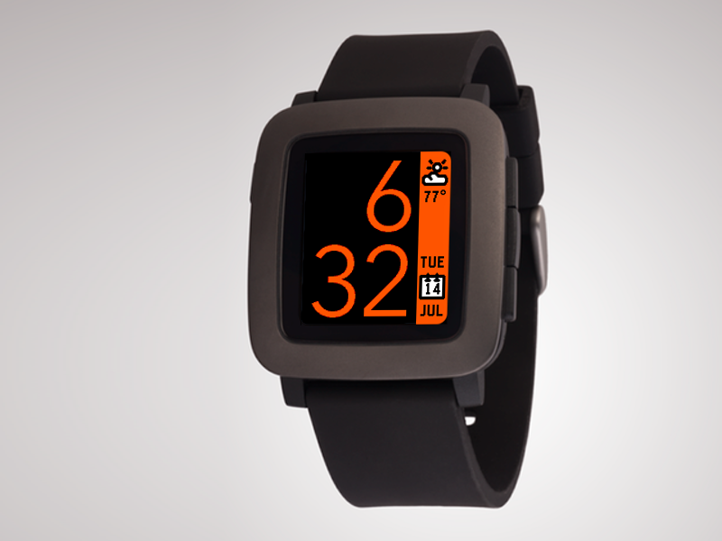

# TimeStyle
A stylish, modern watchface for the Pebble and Pebble Time watches.

Inspired by the visual language of the Timeline found on the Pebble Time, TimeStyle shows you what's happening now: the time, the date, and the current weather conditions!

* Unlike most Pebble faces, the time text is displayed using antialiasing, achieved using automatic palette swapping.
* Configurable: includes over 20 preset color schemes, and also supports custom colors using any color the Pebble Time can display.
* Optional battery life indicator, with optional percentage
* Sidebar can be displayed on the right or left side
* Selectable temperature units
* Bluetooth disconnection icon on disconnect, with optional vibration
* Displays dates in 10 different languages: English, French, German, Spanish, Italian, Dutch, Turkish, Czech, Portuguese, and Greek
* Weather can be disabled entirely
* Optional alternate font, LECO

## Want to try it?
Download on the Pebble store at the link below:
https://apps.getpebble.com/applications/55a5c024f4510f794c000071
