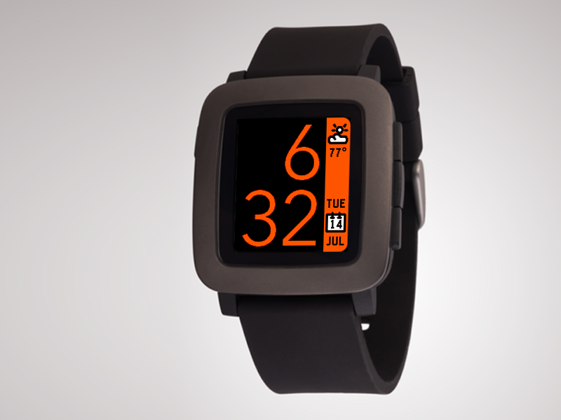

# TimeStyle
A stylish, modern watchface for the Pebble and Pebble Time watches.



Inspired by the visual language of the Timeline found on the Pebble Time, TimeStyle is designed as the “present” to complement the Timeline’s “past” and “future”.

* Readable: With more than 80% of the display area devoted to the time and 6 font options, TimeStyle is designed for readability in all conditions. Unlike most other Pebble faces, time text is displayed using antialiasing, achieved using palette swapping.
* Colorful: includes over 20 preset color schemes, and also supports custom colors using any color the Pebble Time can display&mdash;also supports saving, loading, and sharing custom presets!
* Configurable: TimeStyle features a wide variety of different complications, including step counts, sleep times, weather forecasts, the week number, seconds, the time in another time zone, the battery level, and more.
* Keeps you informed: TimeStyle automatically displays notifications when the battery is low or when your phone disconnects.
* Works in 30 different languages, more than any other Pebble face: English, French, German, Spanish, Italian, Dutch, Turkish, Czech, Slovak, Portuguese, Greek, Swedish, Polish, Romanian, Vietnamese, Catalan, Norwegian, Russian, Estonian, Basque, Finnish, Danish, Lithuanian, Slovenian, Hungarian, Croatian, Serbian, Irish, Latviann, and Ukrainian.

## Want to try it?
Download on the Pebble store at the link below:
https://apps.rebble.io/en_US/application/55a5c024f4510f794c000071?section=watchfaces

## Battery Reporting Webhook

TimeStyle supports remote battery reporting via HTTP POST webhooks. This feature allows you to send battery status data to a remote endpoint for monitoring or integration with other services.

### Configuration

The webhook can be configured in the watchface settings:
- **Remote Endpoint URL**: The URL of your webhook endpoint
- **Remote Endpoint Token**: Optional Bearer token for authentication

### JSON Payload Structure

When battery data is sent, the webhook receives a JSON payload with the following structure:

```json
{
  "battery_percent": 85,
  "is_charging": false,
  "timestamp": "2023-12-07T10:30:45.123Z"
}
```

**Fields:**
- `battery_percent`: Integer (0-100) - Current battery percentage
- `is_charging`: Boolean - `true` if the device is charging, `false` otherwise
- `timestamp`: String (ISO 8601) - UTC timestamp when the data was recorded

### HTTP Request Details

- **Method**: POST
- **Content-Type**: application/json
- **Authorization**: Bearer token (if configured)
- **Body**: JSON payload as described above

### Response Handling

The watchface logs success/failure but does not require specific response handling. Any 2xx status code is considered successful.

### Home Assistant Integration Example

You can integrate the battery reporting with Home Assistant using a webhook automation. Here's a complete example:

**Prerequisites:**
Create these entities in Home Assistant:
- `input_number.pebble_battery_level` - Number input for battery percentage (0-100)
- `input_boolean.pebble_charging` - Boolean for charging status

**Automation YAML:**

```yaml
alias: Update Pebble Battery from Webhook
triggers:
  - webhook_id: pebble_battery
    allowed_methods:
      - POST
    local_only: false
    trigger: webhook
actions:
  - target:
      entity_id: input_number.pebble_battery_level
    data:
      value: "{{ trigger.json.battery_percent }}"
    action: input_number.set_value
  - target:
      entity_id: input_boolean.pebble_charging
    action: input_boolean.turn_{{ 'on' if trigger.json.is_charging else 'off' }}
```

**Setup:**
1. Create the automation in Home Assistant
2. Note the webhook URL provided (e.g., `https://your-home-assistant.com/api/webhook/pebble_battery`)
3. Configure this URL in the TimeStyle settings as the Remote Endpoint URL
4. Optionally add a Bearer token for additional security

**Dashboard Example:**
You can then create a dashboard card showing the Pebble battery status:

```yaml
type: entities
entities:
  - entity: input_number.pebble_battery_level
    name: Pebble Battery
    icon: mdi:battery
  - entity: input_boolean.pebble_charging
    name: Charging
    icon: mdi:battery-charging
```

### Testing with curl

You can test your webhook endpoint using curl to verify it's working correctly before configuring it in TimeStyle.

**Basic test (no authentication):**
```bash
curl -X POST \
  -H "Content-Type: application/json" \
  -d '{
    "battery_percent": 85,
    "is_charging": false,
    "timestamp": "2023-12-07T10:30:45.123Z"
  }' \
  https://your-home-assistant.com/api/webhook/pebble_battery
```

**Test with Bearer token authentication:**
```bash
curl -X POST \
  -H "Content-Type: application/json" \
  -H "Authorization: Bearer your-secret-token" \
  -d '{
    "battery_percent": 42,
    "is_charging": true,
    "timestamp": "2023-12-07T10:30:45.123Z"
  }' \
  https://your-endpoint.com/battery
```

## Contributing
Want to contribute to TimeStyle? Have a look at [the various feature requests that are still outstanding](https://github.com/freakified/TimeStylePebble/issues?q=is%3Aopen+is%3Aissue) -- just comment on one if you're interested in working on it!
